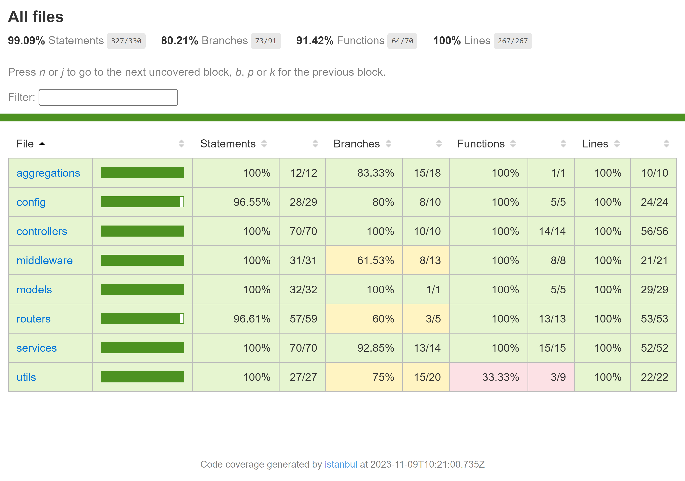

# Cooking Recipes Server 

### This server-side project embodies my extensive knowledge of backend development, as it has been executed with adherence to best practices, standards, and strict guidelines. <br />

---

This server side project stores data in the database and makes it accessible with **REST APIs**, that are written in _NodeJS and typescript_ language, with _express ts_ for the server. <br /> <br />
The project includes the following APIs :

| For authentication and users        | For recipes data                                      |
| ----------------------------------- | ----------------------------------------------------- |
| + Register user                     | + Get recipe by name                                  |
| + Login user                        | + Get list of all the recipes                         |
| + Logout user                       | + Get recipes list by query filters and sortable data |
| + Update user's data                | &emsp; - Authentication is required                   |
| &emsp; - Authentication is required | &emsp; - Pagination included in the response          |
|                                     | + Create a new recipe                                 |
|                                     | &emsp; - Authentication is required                   |
|                                     | + Update existing recipe data                         |
|                                     | &emsp; - Authentication is required                   |
|                                     | + Delete existing recipe                              |
|                                     | &emsp; - Authentication is required                   |

### In addition, the project boasts extensive Swagger API documentation, covering all the REST APIs mentioned above, accessible at: <br /> `http://localhost:3000/swagger` <br />

**NOTE:**
Certain APIs necessitate authentication, requiring users to log in before executing them. These authenticated APIs are denoted by a lock symbol. <br />
 <br />

---

**Requirements**

-   _NodeJS_ version 16.4+
-   _MongoDB service_ version 6.0.1+

**Command lines**

-   **The command to init and install project**
    -   `npm install`
-   **The command to run the project**
    -   `npm run start`<br /> (executing migrations, building the TypeScript code, and running the compiled JavaScript project)
-   Additional commands that are optional
    -   `npm run migrationDB`
        <br />(runs only migration)
    -   `npm run dev`<br /> (runs _typescript_ code for development with _nodemon_)
    -   `npm run test`<br /> (runs only tests with _jest_ + _supertest_ for APIs tests)

---

### Test Coverage:

## 

### The technologies used in this project include:

-   [x] _**Nodejs**_ : the project is _javascript_ based.
-   [x] _**Express**_ : used for the server side routers, middlewares, controllers, and services.
-   [x] _**TypeScript**_ : the project has been implemented using _typescript_ interfaces, `<filenames>.d.ts` declarations files, etc..
-   [x] _**DotEnv**_ : utilizes _dotenv_ files to manage environment variables, and incorporates _dotenv-expand_ to enhance flexibility in the env files.
-   [x] _**Logger**_ : utilizes colorized _**Winston**_ logs with request ID (UUID) for recording server activities stored in daily rotating files (`winston-daily-rotate-file`).
-   [x] _**Passport**_ : authentication with _passport-local_ strategy `{username, password}` for request body.
-   [x] _**MongoDB**_ : utilized with the _**mongoose**_ library for defining schemas and models, which are then utilized in the controllers and services.
-   [x] _**Bcrypt**_ : user passwords are securely encrypted in accordance with best practices to ensure data security.
-   [x] _**Swagger**_ : the `/swagger` URL provides comprehensive API documentation and instructions for testing and debugging APIs,this functionality is available in non-production environments (for development), the project also utilizes _**mongoose-to-swagger**_ to transform mongoose models into Swagger schema docs.
-   [x] _**Migrate-Mongo**_ : the **migrations** ensure that the MongoDB database has the latest updates of the data before running the project, they also handle important database initializations, including user creation and mocked recipes.

### Additional technologies used as development tools include:

-   [x] _**ESLINT**_ : the project adheres to the _ESLint_ guidelines and follows the best practices recommended by _airbnb_.
-   [x] _**Nodemon**_ : watches for _typescript_ file changes and compiles them in real-time.
-   [x] _**Jest**_ : Comprehensive _typescript_ tests with extensive coverage, including password encryption, models, services, and router APIs, have been implemented using the _supertest_ package.
-   [x] _**Mongodb-Memory-Server**_ : running tests on an in-memory database, allowing for efficient and isolated testing.

### In addition, the project incorporates the following features:

-   [x] **Aggregations** : a fully featured aggregate request filters recipes based on query parameters, populates the recipe by its creator, and supports data limiting, offsetting, and sorting options.
-   [x] **Server Side Pagination** : the project implements pagination for the aggregation result data, enabling fetching a limited number of items based on the provided page number and items per page parameters.<br />

    ```json
    {
    "pagination": {
        "totalItems": 487,
        "page": 5,
        "itemsPerPage": 20,
        "totalPages": 25
    },
    "data": [...]
    }
    ```

-   [x] **_Passport_ authentication** : user authentication in the project follows best practices by comparing the encrypted password with the plaintext password provided.
-   [x] **Override toJSON data** : exclude the password from the user object when it is returned as JSON.
-   [x] **_Mongoose_ schema hooks** : incorporates a pre-save hook that encrypts the user's password before creating a new user.
-   [x] **HTTP Status Codes** : HTTP request responses return the appropriate and correct status codes.
-   [x] **_Jest_** : comprehensive tests for thorough validation of all services and functions.
-   [x] **_Postman_** : _postman_ collection for simplified testing and interaction with the project's APIs : </br>
        `cooking-recipes-server-rest-api.postman_collection.json`

## Author

:octocat: **Afek Sakaju**

-   LinkedIn: [@afeksa](https://www.linkedin.com/in/afeksa/)
-   GitHub: [@Afek-Sakaju](https://github.com/Afek-Sakaju)
